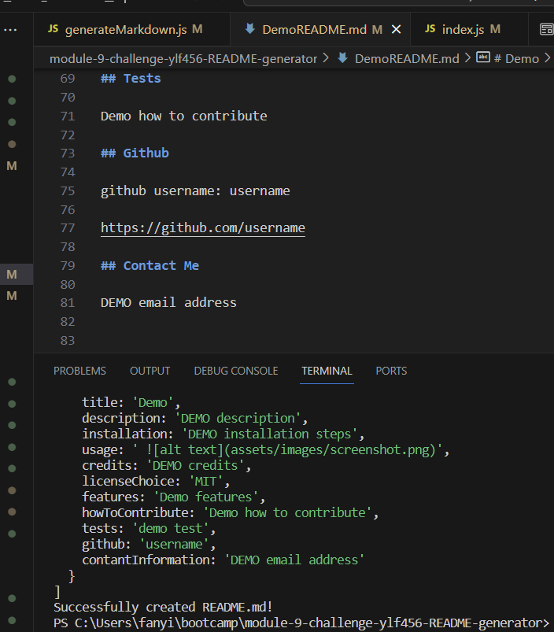

# README.MD generator

## Description

This professional README.md generator was developed using JavaScript by Yilun Fan for educational purposes.

## Installation

VScode , Javascript and Node.js

## usage

This README.md generator can be initiated by typing node index.js in the terminal. After entering the required text following the instructions in the prompts, a standard professional README.md document will be generated, named as DemoREAD.md. For more details on using this application, you can refer to the accompanying video recording located in the root folder.

## Credits

Badge images are generated through https://shields.io/badges.

The prompt messages for creating README.md were sourced from https://coding-boot-camp.github.io/full-stack/github/professional-readme-guide.

## License

N/A

## Link to this application

Link to this Repo: https://github.com/ylf456/module-9-challenge-ylf456-README-generator.git

Link to deployed APP: n/a

## Screenshots

